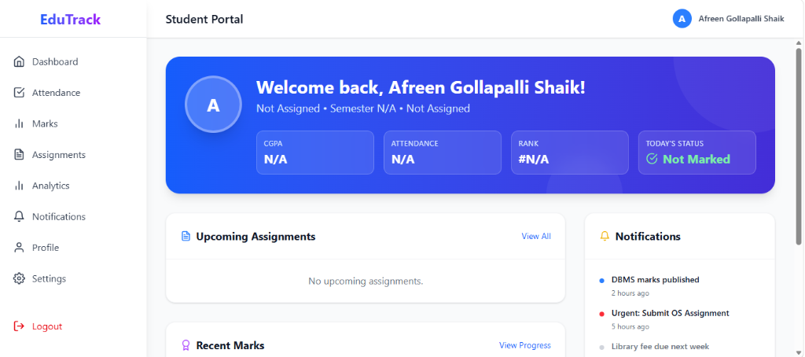
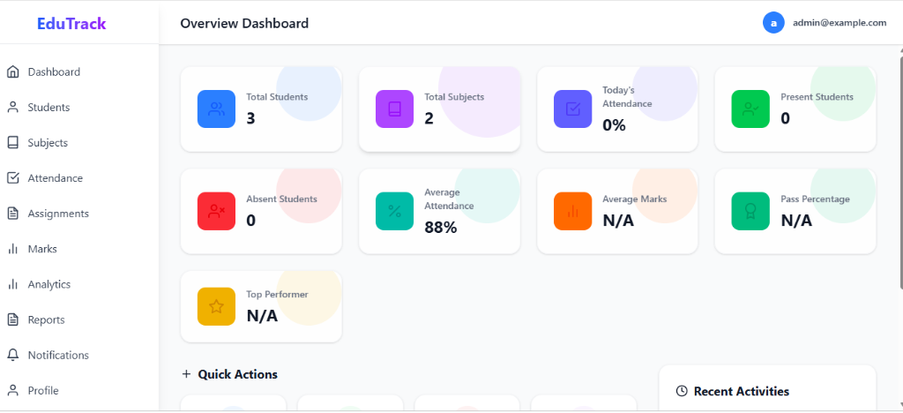
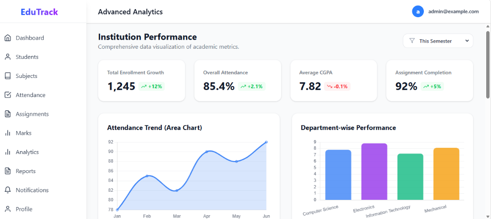

# EduTrack - Student Attendance & Management System

EduTrack is a full-stack web application designed to help administrators and students seamlessly manage and track attendance, marks, and profiles.

## 📸 Screenshots
<p align="center">
  
  
  <br>
  
  
</p>

## 🚀 Features

**Admin Portal:**
- **Dashboard Overview:** View total students, overall attendance, and low attendance alerts.
- **Student Management:** Add, edit, and delete students. Upload profile pictures.
- **Subject Management:** Create and assign subjects.
- **Attendance Tracking:** Mark student attendance quickly and efficiently.
- **Marks Management:** Input and update grades/marks for students.

**Student Portal:**
- **Personal Dashboard:** Track personal attendance records and academic performance.
- **Profile Management:** View and edit contact details and profile picture.

## 💻 Tech Stack
- **Frontend:** React.js, Tailwind CSS, Vite
- **Backend:** Node.js, Express.js
- **Database:** SQLite (Zero-configuration)
- **File Uploads:** Multer

---

## 🛠️ Local Setup Instructions

Follow these steps to run the project locally on your machine. The database is pre-configured to use SQLite, so no external database installation is required!

### 1. Prerequisites
- **Node.js** installed (v16+)

### 2. Backend (Server) Setup
1. Open a terminal and navigate to the backend folder:
   ```bash
   cd server
   ```
2. Install the necessary dependencies:
   ```bash
   npm install
   ```
3. Start the backend development server (this will automatically initialize the `database.sqlite` file and seed dummy data):
   ```bash
   npm run dev
   ```
   *The server should now be running on `http://localhost:5000`*

### 4. Frontend (Client) Setup
1. Open a **new** terminal and navigate to the frontend folder:
   ```bash
   cd client
   ```
2. Install the necessary dependencies:
   ```bash
   npm install
   ```
3. Start the frontend development server:
   ```bash
   npm run dev
   ```
4. Open your browser and navigate to the Local URL provided in the terminal (usually `http://localhost:5175`).

---

## 🔑 Default Routes
- **Admin Login:** `http://localhost:5175/admin-login`
- **Student Login:** `http://localhost:5175/student-login`
